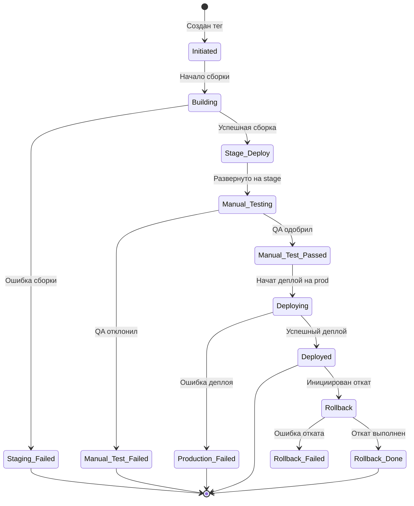

# 📚 CI/CD Pipeline Release Management System
## Полная документация

---

## 📋 Содержание

1. [Обзор системы](#обзор-системы)
2. [Архитектура](#архитектура)
3. [Компоненты системы](#компоненты-системы)
4. [Процессы и workflow](#процессы-и-workflow)
5. [Инструкция по использованию](#инструкция-по-использованию)
6. [Telegram Bot интерфейс](#telegram-bot-интерфейс)
7. [Настройка и конфигурация](#настройка-и-конфигурация)
8. [Мониторинг и логирование](#мониторинг-и-логирование)
9. [Troubleshooting](#troubleshooting)

---

## 🎯 Обзор системы

### Что это?

**Release Management System** - это автоматизированная система управления релизами, которая обеспечивает:

- 🚀 Автоматическое развертывание кода на различных окружениях
- 🧪 Поддержку ручного тестирования перед продакшеном
- ⏪ Возможность быстрого отката на предыдущие версии
- 📊 Полный контроль через Telegram Bot
- 📝 Детальное логирование всех операций

### Ключевые преимущества

✅ **Безопасность** - многоступенчатая проверка перед продакшеном  
✅ **Скорость** - автоматизация рутинных операций  
✅ **Контроль** - полная видимость процесса через Telegram  
✅ **Надежность** - возможность мгновенного отката  
✅ **Прозрачность** - детальные логи на каждом этапе

---

## 🏗️ Архитектура

### Схема взаимодействия компонентов

```
┌─────────────────────────────────────────────────────────────────┐
│                         GitHub Repository                        │
│  ┌──────────────┐  ┌──────────────┐  ┌──────────────┐         │
│  │ Work Branch  │  │  Version Tag  │  │ Main Branch  │         │
│  └──────┬───────┘  └──────┬───────┘  └──────────────┘         │
│         │                  │                                     │
└─────────┼──────────────────┼────────────────────────────────────┘
          │                  │
          ▼                  ▼
    ┌──────────┐      ┌──────────────┐
    │   Dev    │      │ GitHub Action│
    │  Server  │      │   Workflow   │
    └──────────┘      └──────┬───────┘
                             │
                             ▼
                  ┌─────────────────────┐
                  │   Release API       │
                  │  (FastAPI Server)   │
                  └─────────┬───────────┘
                            │
                ┌───────────┴───────────┐
                ▼                       ▼
        ┌──────────────┐      ┌──────────────┐
        │Stage Server  │      │  PostgreSQL  │
        │   (Test)     │      │   Database   │
        └──────┬───────┘      └──────────────┘
               │                       ▲
               ▼                       │
        ┌──────────────┐              │
        │ Manual Test  │──────────────┘
        │ (Telegram)   │
        └──────┬───────┘
               │
               ▼
        ┌──────────────┐
        │ Production   │
        │   Server     │
        └──────────────┘
```

### Окружения (Environments)

| Окружение | Назначение | Автоматизация | Доступ |
|-----------|------------|---------------|---------|
| **Dev** | Разработка | Push в ветку | Разработчики |
| **Stage** | Тестирование | Создание тега | QA команда |
| **Production** | Боевой сервер | После одобрения | Ограниченный |

---

## 🔧 Компоненты системы

### 1. GitHub Actions Workflows

#### 📁 `on-push-in-work-branch.yaml.yml`
**Назначение:** Автоматическое обновление dev-сервера при push в рабочую ветку

**Когда запускается:**
- Push в любую ветку, кроме main/master/develop

**Что делает:**
1. Определяет автора коммита
2. Находит персональный dev-сервер разработчика
3. Обновляет код и пересобирает контейнер
4. Проверяет health-check
5. Отправляет уведомление в Telegram

#### 📁 `on-create-version-tag.yaml.yml`
**Назначение:** Развертывание на stage при создании версионного тега

**Когда запускается:**
- Создание тега формата `v*` (например, v1.0.0)

**Что делает:**
1. Создает запись о релизе в БД
2. Обновляет stage-сервер до версии тега
3. Запускает контейнер и проверяет работоспособность
4. Переводит релиз в статус "Ручное тестирование"
5. Уведомляет QA команду через Telegram Bot

#### 📁 `on-approve-manual-testing.yaml.yml`
**Назначение:** Развертывание на production после одобрения

**Когда запускается:**
- Ручной запуск после одобрения в Telegram Bot

**Что делает:**
1. Валидирует входные параметры
2. Развертывает одобренную версию на production
3. Выполняет health-check
4. Обновляет статус релиза
5. Логирует весь процесс

### 2. Release API Server

**Технологии:** FastAPI, PostgreSQL, AsyncPG

**Основные endpoints:**

```python
POST   /api/tg-bot/release        # Создание нового релиза
PATCH  /api/tg-bot/release        # Обновление статуса релиза
POST   /api/tg-bot/update          # Webhook для Telegram
GET    /api/tg-bot/health          # Health check
```

### 3. Telegram Bot

**Функционал:**
- 📊 Просмотр активных релизов
- ✅ Одобрение/отклонение релизов
- ⏪ Инициация откатов
- 📈 История релизов

### 4. База данных

**Структура таблицы `releases`:**

```sql
CREATE TABLE releases (
    id SERIAL PRIMARY KEY,
    service_name TEXT NOT NULL,
    release_tag TEXT NOT NULL,
    rollback_to_tag TEXT DEFAULT '',
    status TEXT NOT NULL,
    initiated_by TEXT NOT NULL,
    github_run_id TEXT NOT NULL,
    github_action_link TEXT NOT NULL,
    github_ref TEXT NOT NULL,
    created_at TIMESTAMP DEFAULT CURRENT_TIMESTAMP,
    started_at TIMESTAMP DEFAULT CURRENT_TIMESTAMP,
    completed_at TIMESTAMP NULL
);
```

---

## 🔄 Процессы и Workflow

### Жизненный цикл релиза



### Статусы релиза

| Статус | Описание | Следующие действия |
|--------|----------|-------------------|
| `initiated` | Релиз создан | Автоматическая сборка |
| `building` | Идет сборка | Ожидание результата |
| `staging_failed` | Ошибка на stage | Требуется исправление |
| `manual_testing` | Готов к тестированию | QA проверка |
| `manual_test_passed` | Тесты пройдены | Деплой на production |
| `manual_test_failed` | Тесты не пройдены | Исправление и новый релиз |
| `deploying` | Деплой на production | Ожидание |
| `deployed` | Успешно в production | Мониторинг |
| `production_failed` | Ошибка production | Откат или исправление |
| `rollback` | Выполняется откат | Ожидание |
| `rollback_done` | Откат выполнен | Анализ проблемы |

---

## 📖 Инструкция по использованию

### Для разработчиков

#### 1. Работа с feature-веткой

```bash
# Создание новой ветки
git checkout -b feature/new-feature

# Внесение изменений
git add .
git commit -m "feat: добавлен новый функционал"

# Push изменений (автоматический деплой на dev)
git push origin feature/new-feature
```

**Результат:** Код автоматически развернется на вашем персональном dev-сервере

#### 2. Создание релиза

```bash
# Переключение на main
git checkout main
git pull origin main

# Создание тега версии
git tag v1.2.3 -m "Release v1.2.3: описание изменений"

# Отправка тега
git push origin v1.2.3
```

**Результат:** Автоматический деплой на stage и уведомление QA команды

### Для QA инженеров

#### 1. Получение уведомления

После создания тега вы получите уведомление в Telegram Bot:

```
🚀 Новый релиз готов к тестированию
📦 Сервис: loom-content
🏷️ Версия: v1.2.3
👤 Инициатор: developer_name
🔗 GitHub Action: [ссылка]
```

#### 2. Тестирование

1. Откройте Telegram Bot командой `/start`
2. Выберите "🚀 Активные релизы"
3. Найдите нужный релиз
4. Проведите тестирование на stage-сервере

#### 3. Принятие решения

**Если тесты пройдены:**
- Нажмите "✅ Подтвердить"
- Релиз автоматически развернется на production

**Если найдены проблемы:**
- Нажмите "❌ Отклонить"
- Уведомите разработчика о проблемах

### Для DevOps инженеров

#### Мониторинг релизов

```bash
# Проверка логов на сервере
tail -f /var/log/deployments/loom-content/v1.2.3.log

# Проверка статуса контейнера
docker ps | grep loom-content
docker logs loom-content

# Health check
curl http://localhost:8004/api/content/health
```

#### Ручной откат (экстренный)

```bash
# SSH на production сервер
ssh root@prod-server

# Переход в директорию
cd loom/loom-content

# Откат на предыдущий тег
git checkout v1.2.2

# Пересборка контейнера
cd ../loom-system
docker compose -f ./docker-compose/app.yaml up -d --build loom-content
```

---

## 🤖 Telegram Bot интерфейс

### Главное меню

```
🤖 Release Bot

👋 Привет, {name}!

Я помогу тебе отслеживать и управлять релизами.
Здесь ты можешь просматривать активные релизы и управлять ими.

Выбери действие:
[🚀 Активные релизы]
[✅ Успешные релизы]
[❌ Провальные релизы]
```

### Активные релизы

```
🚀 Активные релизы

📦 loom-content
🏷️ Tag: v1.2.3
🔄 Статус: 🧪 Ручное тестирование
👤 Инициатор: developer_name
📅 Создан: 15.03.2024 14:30
🔗 GitHub Action: [Открыть]
⏱️ В обработке: 15 мин

[✅ Подтвердить] [❌ Отклонить]
[🔄 Обновить]
[⬅️ Назад в меню]
```

### Успешные релизы

```
✅ Успешные релизы

📦 loom-content
🏷️ Tag: v1.2.2
🔄 Статус: ✅ Задеплоен
👤 Инициатор: developer_name
📅 Создан: 14.03.2024 10:00
🚀 Задеплоен: 14.03.2024 10:45
🔗 GitHub Action: [Открыть]

[⏪ Откатить]
[🔄 Обновить]
[⬅️ Назад в меню]
```

### Процесс отката

```
⚠️ Подтверждение отката

❗ ВНИМАНИЕ! Вы собираетесь откатить релиз!

📦 Сервис: loom-content
🏷️ Текущий tag: v1.2.3
⏪ Откатить на tag: v1.2.2
📅 Дата деплоя выбранной версии: 14.03.2024 10:45

⚠️ Это действие приведет к откату сервиса на выбранную версию.
⚠️ Убедитесь, что откат действительно необходим!

[✅ Да, откатить] [Назад]
```

---

## ⚙️ Настройка и конфигурация

### Переменные окружения

#### `.env.servers` (на GitHub runner)

```bash
# API Configuration
LOOM_RELEASE_TG_BOT_API_URL=https://api.example.com/api/tg-bot
LOOM_INTERSERVER_SECRET_KEY=your-secret-key

# Developer servers
developer1_HOST=192.168.1.10
developer1_PASSWORD=secure-password

developer2_HOST=192.168.1.11
developer2_PASSWORD=secure-password

# Stage server
STAGE_HOST=192.168.1.20
STAGE_PASSWORD=secure-password

# Production server
PROD_HOST=192.168.1.30
PROD_PASSWORD=secure-password
```

#### Конфигурация сервиса

```python
# internal/config/config.py

class Config:
    def __init__(self):
        # Service configuration
        self.service_name = os.getenv("LOOM_RELEASE_TG_BOT_CONTAINER_NAME")
        self.http_port = os.getenv("LOOM_RELEASE_TG_BOT_PORT", "8000")
        self.prefix = os.getenv("LOOM_RELEASE_TG_BOT_PREFIX", "/api/tg-bot")
        
        # Telegram Bot
        self.release_tg_bot_token = os.environ.get('LOOM_RELEASE_TG_BOT_TOKEN')
        
        # Database
        self.db_host = os.getenv("LOOM_RELEASE_TG_BOT_POSTGRES_CONTAINER_NAME")
        self.db_name = os.getenv("LOOM_RELEASE_TG_BOT_POSTGRES_DB_NAME")
        self.db_user = os.getenv("LOOM_RELEASE_TG_BOT_POSTGRES_USER")
        self.db_pass = os.getenv("LOOM_RELEASE_TG_BOT_POSTGRES_PASSWORD")
```

### Docker Compose конфигурация

```yaml
version: '3.8'

services:
  loom-release-tg-bot:
    build: 
      context: ../loom-release-tg-bot
      dockerfile: .github/Dockerfile
    container_name: loom-release-tg-bot
    environment:
      - ENVIRONMENT=production
      - LOG_LEVEL=INFO
    ports:
      - "8000:8000"
    depends_on:
      - postgres
    networks:
      - loom-network
    volumes:
      - ./logs:/var/log/deployments
    healthcheck:
      test: ["CMD", "curl", "-f", "http://localhost:8000/api/tg-bot/health"]
      interval: 30s
      timeout: 10s
      retries: 3
```

---

## 📊 Мониторинг и логирование

### Структура логов

```
/var/log/deployments/
├── loom-content/
│   ├── v1.2.3.log         # Stage deployment
│   └── v1.2.2.log
├── production/
│   └── loom-content/
│       ├── v1.2.3-prod.log # Production deployment
│       └── v1.2.2-prod.log
└── rollback/
    └── loom-content/
        └── v1.2.2-rollback.log
```

### Пример лога деплоя

```
2024-03-15 14:30:00 - 🚀 Начинаем деплой тега v1.2.3
2024-03-15 14:30:01 - 📥 Обновляем репозиторий и теги
2024-03-15 14:30:02 - 🔍 Текущее состояние: v1.2.2
2024-03-15 14:30:03 - 📥 Получаем обновления из удаленного репозитория
2024-03-15 14:30:05 - ✅ Тег v1.2.3 найден и готов к использованию
2024-03-15 14:30:06 - 🏷️ Переключаемся на тег v1.2.3
2024-03-15 14:30:07 - 🧹 Очищаем старые ветки
2024-03-15 14:30:08 - 🔨 Начинаем сборку контейнера для тега v1.2.3...
2024-03-15 14:31:00 - 🔍 Проверка health (попытка 1 из 3)...
2024-03-15 14:31:05 - ✅ Health check пройден!
2024-03-15 14:31:06 - ✅ Тег v1.2.3 успешно развернут и приложение работает!
```

### Метрики (OpenTelemetry)

Система собирает следующие метрики:

- **HTTP метрики:**
  - `http.server.request.duration` - длительность запроса
  - `http.server.active_requests` - активные запросы
  - `http.server.ok.request.total` - успешные запросы
  - `http.server.error.request.total` - ошибочные запросы

- **Telegram метрики:**
  - `telegram.server.ok.message.total` - обработанные сообщения
  - `telegram.server.error.message.total` - ошибки обработки
  - `telegram.server.message.duration` - время обработки

---

## 🔧 Troubleshooting

### Частые проблемы и решения

#### 1. Тег не найден при деплое

**Проблема:**
```
❌ Тег v1.2.3 не найден в репозитории после обновления!
```

**Решение:**
```bash
# Проверить, что тег отправлен в remote
git push origin v1.2.3

# Принудительное обновление тегов на сервере
git fetch origin --tags --force
```

#### 2. Health check не проходит

**Проблема:**
```
❌ Health check не пройден после 3 попыток
```

**Решение:**
```bash
# Проверить логи контейнера
docker logs loom-content

# Проверить порты
netstat -tulpn | grep 8004

# Ручная проверка health
curl -v http://localhost:8004/api/content/health
```

#### 3. Откат не выполняется

**Проблема:**
```
❌ Ошибка при выполнении отката
```

**Решение:**
```bash
# Проверить доступность предыдущей версии
git tag -l | grep v1.2.2

# Ручной откат
git checkout v1.2.2
docker compose up -d --build loom-content
```

#### 4. Telegram Bot не отвечает

**Проблема:**
Bot не реагирует на команды

**Решение:**
```bash
# Проверить webhook
curl https://api.example.com/api/tg-bot/webhook/set

# Проверить логи бота
docker logs loom-release-tg-bot

# Перезапустить бота
docker restart loom-release-tg-bot
```

### Команды для диагностики

```bash
# Статус всех контейнеров
docker ps -a | grep loom

# Проверка БД
psql -h localhost -U postgres -d releases -c "SELECT * FROM releases ORDER BY created_at DESC LIMIT 5;"

# Проверка дискового пространства
df -h

# Проверка памяти
free -m

# Активные процессы
htop

# Сетевые соединения
ss -tulpn
```

---

## 📈 Best Practices

### Для разработчиков

1. **Версионирование:**
   - Используйте семантическое версионирование (v1.2.3)
   - Major.Minor.Patch

2. **Коммиты:**
   - Пишите понятные сообщения коммитов
   - Используйте conventional commits

3. **Ветки:**
   - feature/* - для новых фич
   - bugfix/* - для исправлений
   - hotfix/* - для срочных правок

### Для QA

1. **Тестирование:**
   - Всегда проверяйте критический функционал
   - Документируйте найденные проблемы
   - Используйте чек-листы

2. **Коммуникация:**
   - Быстро реагируйте на новые релизы
   - Четко описывайте проблемы
   - Координируйтесь с разработчиками

### Для DevOps

1. **Мониторинг:**
   - Настройте алерты на критические метрики
   - Регулярно проверяйте логи
   - Следите за дисковым пространством

2. **Безопасность:**
   - Регулярно обновляйте пароли
   - Используйте SSH ключи где возможно
   - Ограничивайте доступ к production

---

## 🎉 Заключение

Release Management System обеспечивает:

✅ **Автоматизацию** - минимум ручной работы  
✅ **Контроль** - полная видимость процесса  
✅ **Безопасность** - многоступенчатая проверка  
✅ **Скорость** - быстрый деплой и откат  
✅ **Надежность** - детальное логирование

Система постоянно развивается и улучшается. При возникновении вопросов обращайтесь к команде DevOps.

---

## 📞 Контакты и поддержка

- **Telegram:** @gommgo
