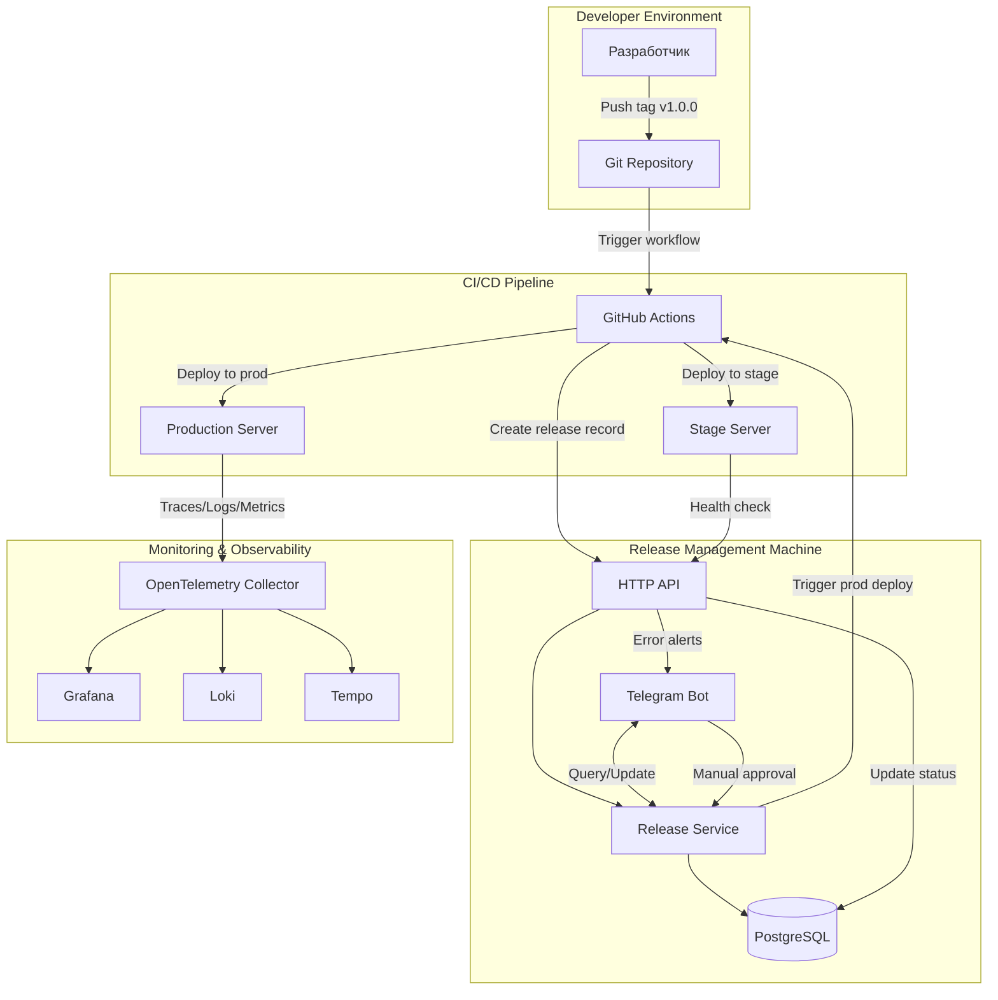
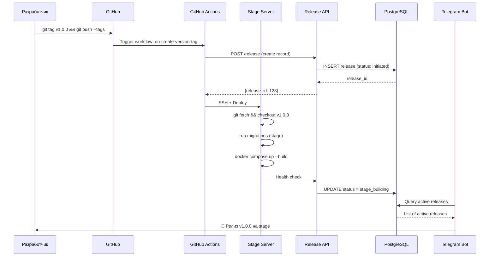
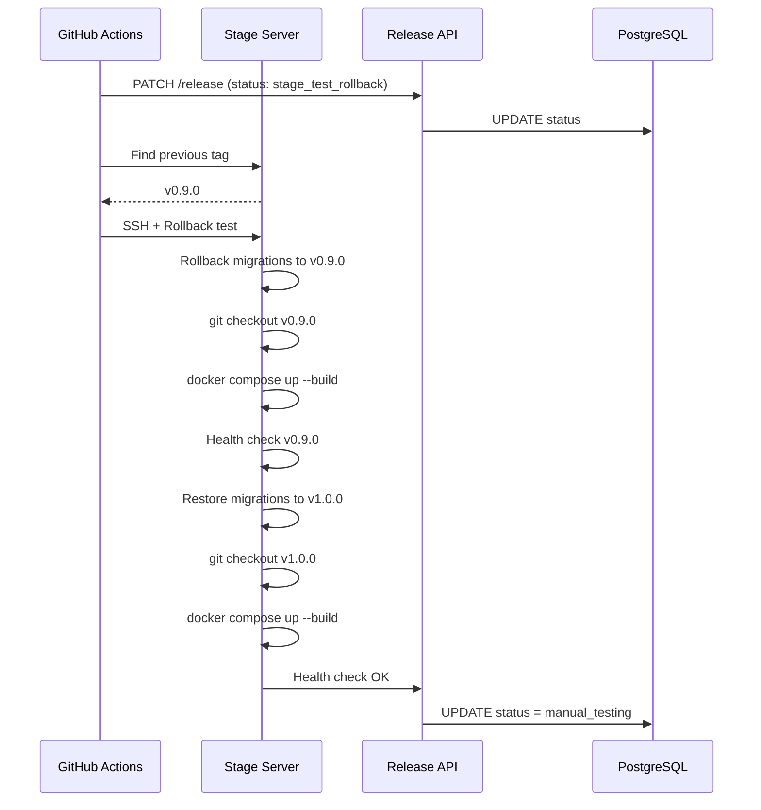
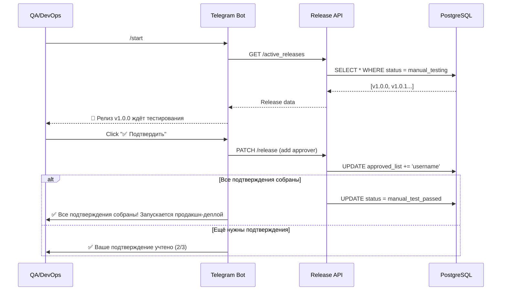
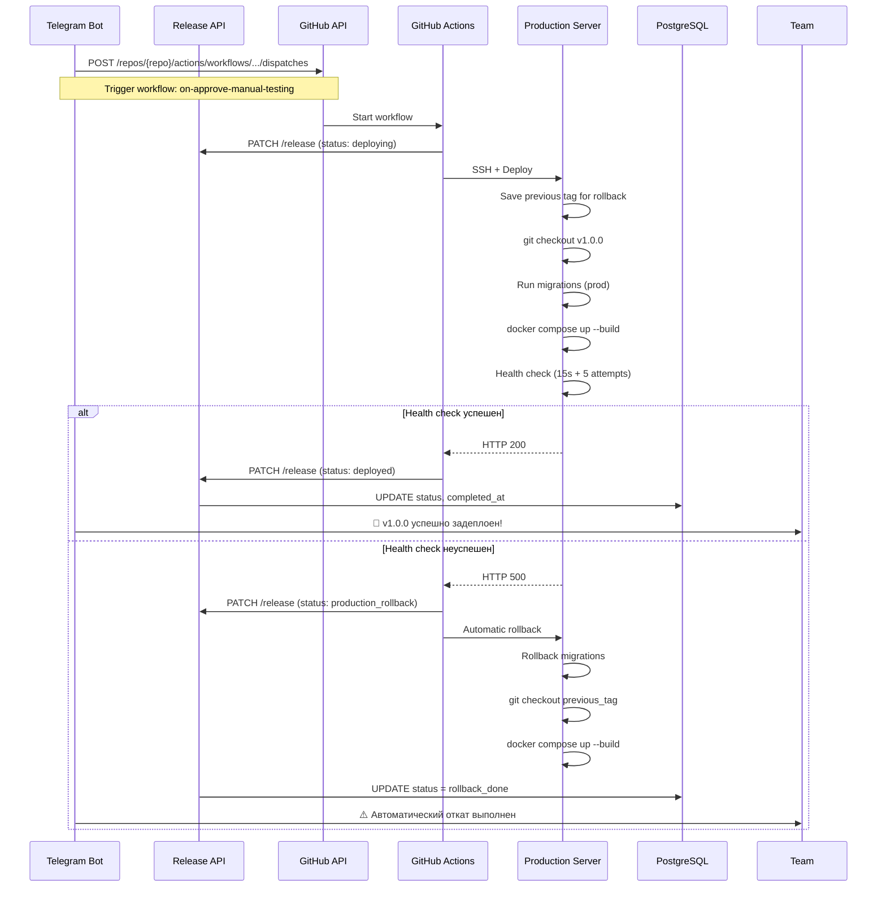
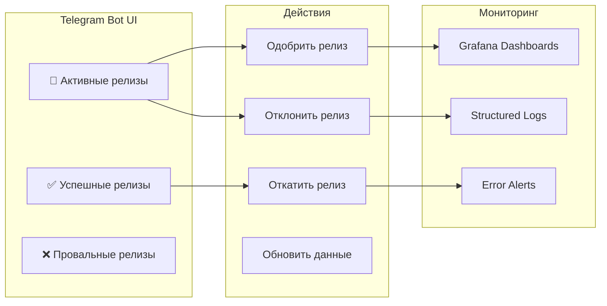
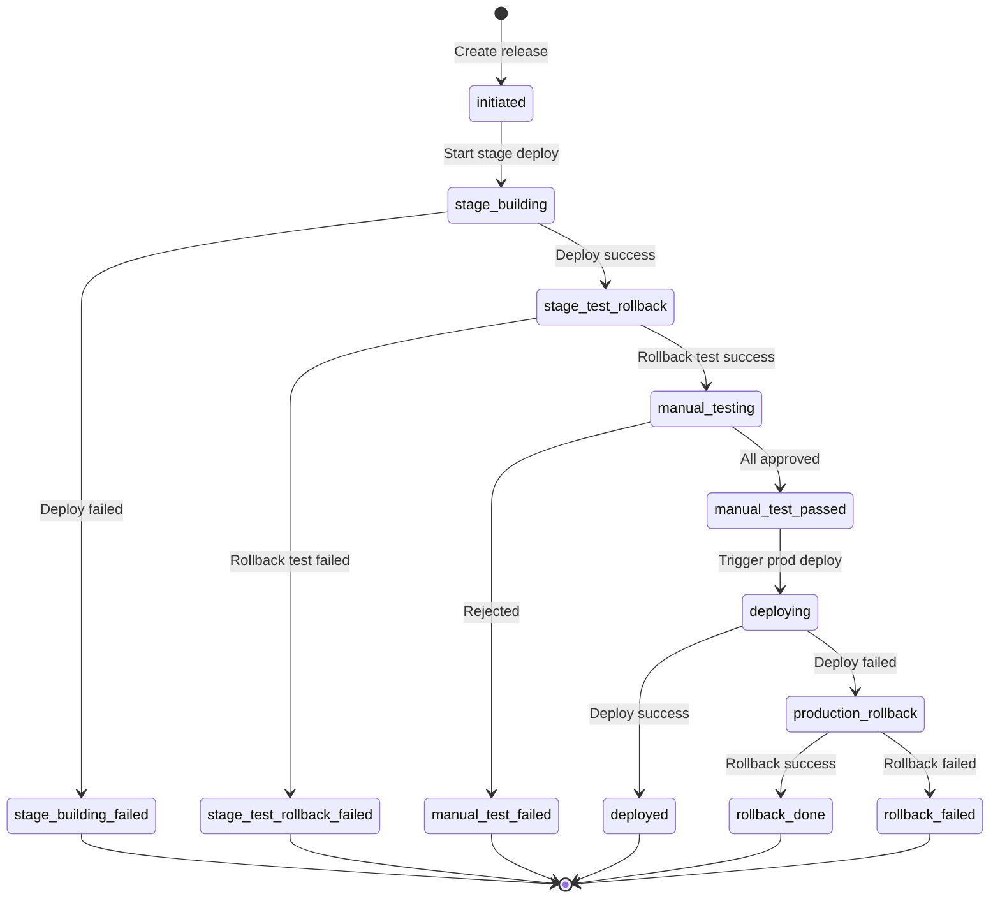

# Release Management Machine

## 📋 Концептуальный обзор

**Release Management Machine** — это комплексная автоматизированная система управления жизненным циклом релизов в микросервисной архитектуре. Инструмент решает критическую проблему координации и контроля процесса развертывания изменений в продуктивную среду, обеспечивая прозрачность, безопасность и возможность быстрого отката.

---

## 🎯 Ключевые проблемы, которые решает система

### 1. **Отсутствие единой точки контроля релизов**

**Проблема:** В микросервисной архитектуре с множеством независимых сервисов теряется общая картина происходящих релизов. Команда не знает, какие сервисы сейчас находятся в процессе обновления, на каком этапе они находятся, и кто за них отвечает.

**Решение:** Централизованный Telegram-бот с веб-интерфейсом предоставляет единую точку входа для мониторинга всех активных, успешных и проваленных релизов в реальном времени.

### 2. **Отсутствие процесса manual testing и approval**

**Проблема:** Прямой деплой в продакшн без валидации на stage-окружении несёт высокие риски. Необходим механизм, позволяющий ответственным лицам протестировать изменения и дать явное одобрение.

**Решение:** Встроенный workflow ручного тестирования с системой подтверждений от нескольких approvers перед продакшн-деплоем.

### 3. **Сложность и непрозрачность процесса отката**

**Проблема:** При возникновении проблем в продакшне критически важна скорость отката. Ручной откат требует знания инфраструктуры, доступа к серверам и может занимать драгоценное время.

**Решение:** Автоматизированный откат одним кликом через Telegram-интерфейс с автоматическим откатом миграций БД и восстановлением предыдущей версии.

### 4. **Отсутствие истории релизов и аудита**

**Проблема:** Сложно отследить, кто, когда и какие изменения вносил в продакшн. При инциденте невозможно быстро определить, какой релиз мог вызвать проблему.

**Решение:** Полная история всех релизов с метаданными: инициатор, временные метки, статусы, ссылки на GitHub Actions, список approvers.

### 5. **Разрозненность инструментов**

**Проблема:** GitHub Actions для CI/CD, SSH для доступа к серверам, ручные скрипты для отката, разные чаты для коммуникации — всё это создаёт фрагментацию процесса.

**Решение:** Единая интегрированная платформа, объединяющая GitHub Actions, SSH-автоматизацию, Telegram-интерфейс и систему мониторинга.

---

## 🏗️ Архитектура системы



---

## 🔄 Полный жизненный цикл релиза

### Фаза 1: Инициация релиза



**Ключевые моменты:**
- Создание тега автоматически запускает процесс
- Релиз регистрируется в БД с уникальным ID
- Stage-деплой включает миграции и health checks
- Telegram-бот немедленно уведомляет команду

### Фаза 2: Тестирование отката



**Зачем это нужно:**
- Проверка работоспособности процедуры отката ДО продакшна
- Гарантия, что в случае проблем откат сработает
- Автоматическое восстановление после теста

### Фаза 3: Ручное тестирование и approval



**Преимущества:**
- Визуальный интерфейс с полной информацией о релизе
- Требование подтверждения от нескольких человек (configurable)
- Невозможность случайного деплоя
- Полная трассируемость: кто и когда одобрил

### Фаза 4: Продакшн-деплой



**Критические особенности:**
- Автоматическое сохранение предыдущей версии для отката
- Health checks с повторными попытками
- Автоматический rollback при сбое
- Детальное логирование каждого шага

### Фаза 5: Мониторинг и управление



---

## 🎨 Интерфейс Telegram Bot

### Главное меню

```
🤖 Release Bot

👋 Привет, Ivan!

Я помогу тебе отслеживать и управлять релизами.
Здесь ты можешь просматривать активные релизы и управлять ими.

Выбери действие:
┌─────────────────────────┐
│ 🚀 Активные релизы      │
│ ✅ Успешные релизы      │
│ ❌ Провальные релизы    │
└─────────────────────────┘
```

### Просмотр активного релиза

```
🚀 Активные релизы

📦 name-authorization
🏷️ Tag: v1.2.3
🔄 Статус: 🧪 Ручное тестирование
👤 Инициатор: gommgo
📅 Создан: 30.09.2025 14:30
⏱️ В обработке: 15 мин
🔗 GitHub Action: [Открыть]

Необходимые подтверждения:
@gommgo
@tech_lead
@devops_lead

📋 Подтвердили:
@gommgo

┌──────────────┬──────────────┐
│ ✅ Подтвердить │ ❌ Отклонить │
└──────────────┴──────────────┘
┌────────────────────────────┐
│      🔄 Обновить           │
│   ⬅️ Назад в меню         │
└────────────────────────────┘

📊 1/3     [⬅️ Пред] [След ➡️]
```

### Откат релиза

```
⏪ Выбор tag для отката

📦 Сервис: name-authorization
🏷️ Текущий tag: v1.2.3

📋 Выберите версию для отката:

┌─────────────────────────────────┐
│ 🏷️ v1.2.2 (29.09.2025 18:45)  │
│ 🏷️ v1.2.1 (28.09.2025 12:20)  │
│ 🏷️ v1.2.0 (27.09.2025 09:15)  │
└─────────────────────────────────┘

[Назад]
```

---

## 🔧 Технический стек

### Backend
- **Python 3.12** — основной язык
- **FastAPI** — HTTP API для GitHub Actions и webhooks
- **aiogram 3.4** — Telegram Bot framework
- **aiogram-dialog** — UI-диалоги в Telegram
- **SQLAlchemy 2.0** — ORM для работы с БД
- **asyncpg** — асинхронный PostgreSQL драйвер

### Infrastructure
- **PostgreSQL** — хранение данных о релизах
- **Redis** — кэширование и дедупликация алертов
- **Docker** — контейнеризация сервисов
- **asyncssh** — асинхронные SSH-подключения для автоматизации

### Observability
- **OpenTelemetry** — распределённая трассировка
- **Grafana** — визуализация метрик и логов
- **Loki** — агрегация логов
- **Tempo** — хранение трейсов

### CI/CD
- **GitHub Actions** — оркестрация пайплайнов
- **Self-hosted runners** — выполнение на собственной инфраструктуре

---

## 📊 Модель данных

### Таблица releases

```sql
CREATE TABLE releases (
    id SERIAL PRIMARY KEY,
    
    -- Основная информация
    service_name TEXT NOT NULL,
    release_tag TEXT NOT NULL,
    rollback_to_tag TEXT DEFAULT '',
    status TEXT NOT NULL,
    
    -- Метаданные
    initiated_by TEXT NOT NULL,
    github_run_id TEXT NOT NULL,
    github_action_link TEXT NOT NULL,
    github_ref TEXT NOT NULL,
    approved_list TEXT DEFAULT '[]',
    
    -- Временные метки
    created_at TIMESTAMP DEFAULT CURRENT_TIMESTAMP,
    started_at TIMESTAMP DEFAULT CURRENT_TIMESTAMP,
    completed_at TIMESTAMP NULL
);
```

### Статусы релиза



---

## 🚀 Ключевые возможности

### 1. Multi-approver система

Настраиваемый список approvers гарантирует, что критические изменения проходят через несколько пар глаз:

```python
required_approve_list = ["gommgo", "tech_lead", "devops_lead"]
```

### 2. Автоматический откат при сбое

Если health check не проходит на продакшне, система автоматически:
1. Откатывает миграции БД
2. Возвращается на предыдущий git tag
3. Пересобирает контейнер
4. Проверяет работоспособность

### 3. Интеграция с GitHub Actions

Система триггерит workflows через GitHub API:

```python
await github_client.trigger_workflow(
    owner="YourOrg",
    repo="name-authorization",
    workflow_id="on-approve-manual-testing.yaml.yml",
    inputs={
        "release_id": "123",
        "release_tag": "v1.0.0"
    }
)
```

### 4. Распределённая трассировка

Каждый запрос имеет trace_id, позволяющий проследить путь от Telegram-команды до изменений на сервере:

```
trace_id: a1b2c3d4e5f6g7h8
├─ TgMiddleware.trace_middleware01
├─ ActiveReleaseService.handle_confirm_yes
├─ ReleaseService.update_release
├─ ReleaseRepo.update_release
└─ PG.update
```

### 5. Откат одним кликом

Через Telegram Bot можно откатить любой успешный релиз на предыдущую версию без доступа к серверам или знания инфраструктуры.

---

## 🔐 Безопасность

### SSH-автоматизация без хранения ключей

Использование паролей через asyncssh с ограниченным временем сессии:

```python
async with asyncssh.connect(
    host=prod_host,
    username="root",
    password=prod_password,
    connect_timeout=30,
    known_hosts=None
) as conn:
    # Выполнение команд
```

### Ограничение прав

- Только указанные пользователи могут одобрять релизы
- Только администраторы могут инициировать откат
- Все действия логируются с username

### Секреты в GitHub Actions

Все чувствительные данные хранятся как GitHub Secrets и не попадают в логи.

---

## 📈 Мониторинг и алертинг

### Автоматические алерты в Telegram

При ошибках система автоматически отправляет уведомления в выделенный Telegram-чат с:
- Trace ID для быстрой диагностики
- Ссылками на Grafana (логи и трейсы)
- AI-анализом ошибки через OpenAI

### Метрики

Система собирает метрики о:
- Времени выполнения релизов
- Проценте успешных/неуспешных релизов
- Времени от создания тега до продакшн-деплоя
- Количестве откатов

---

## 🎯 Преимущества использования

### Для DevOps команды
- ✅ Полная автоматизация рутинных операций
- ✅ Единая точка контроля всех релизов
- ✅ Быстрый откат при проблемах
- ✅ Детальные логи каждого шага

### Для разработчиков
- ✅ Простота использования (git tag → автоматический деплой)
- ✅ Прозрачность процесса
- ✅ Уверенность в безопасности (multi-approval)
- ✅ Быстрая обратная связь

### Для бизнеса
- ✅ Снижение времени time-to-market
- ✅ Минимизация рисков при релизах
- ✅ Полный аудит всех изменений
- ✅ Быстрое восстановление при инцидентах

---

## 📝 Заключение

Release Management Machine — это не просто инструмент автоматизации, это целая философия безопасного и контролируемого управления релизами. Система объединяет лучшие практики DevOps, современные технологии мониторинга и удобный пользовательский интерфейс в единое решение.

Благодаря продуманной архитектуре, система масштабируется от небольших команд до крупных организаций с десятками микросервисов, обеспечивая при этом единообразие процессов и высокий уровень надёжности.

---

## 🔗 Дополнительные ресурсы

- **Grafana Dashboards:** Мониторинг релизов в реальном времени
- **GitHub Actions Workflows:** Автоматизированные пайплайны
- **OpenTelemetry:** Распределённая трассировка запросов
- **Telegram Bot:** @ReleaseManagementBot